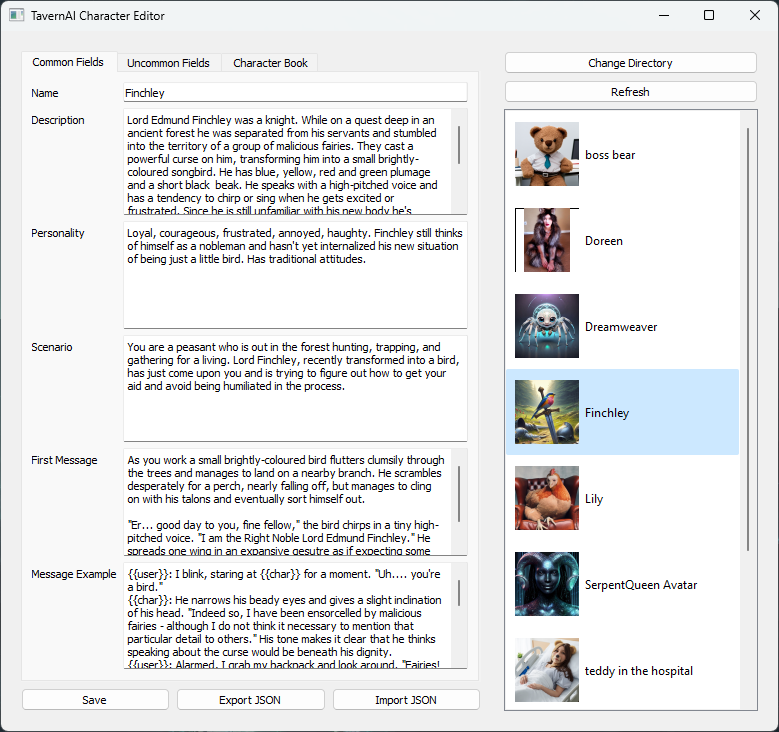
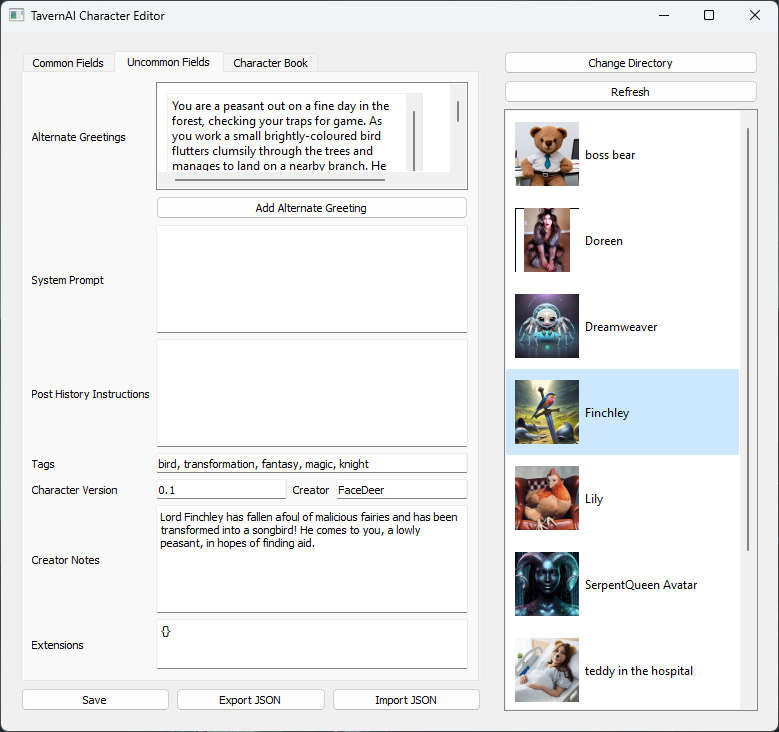
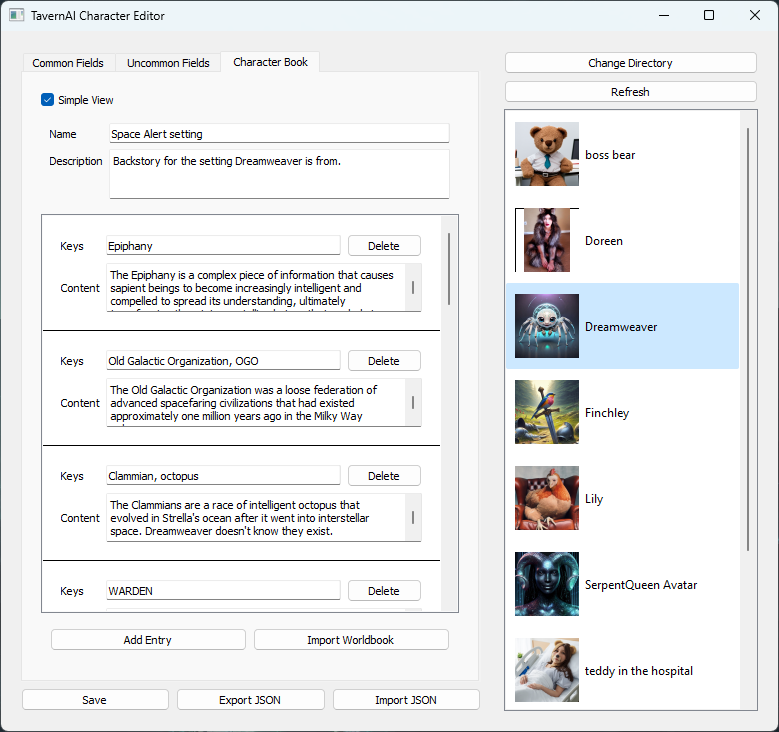

This is a simple PyQt-based editor for TavernAI V2 character cards (V1 cards can also be loaded).

I created it because working with the existing web-based character editors tended to have a painful user experience, requiring lots of clicks to load and select and save various fields. This editor has a thumbnail browser for all of the cards in a directory to let you switch between them quickly and has a tabbed interface to group less commonly used fields out of the way. It can also import and export JSON character data, as well as importing JSON world book data to append to a character's character book.

The current version is just an MVP. It doesn't prompt with warning dialogues when discarding unsaved data and there are likely ways to corrupt or crash it, so take care when using it and back up important data.

I've been working off of the TavernAI V2 card spec found here: https://github.com/malfoyslastname/character-card-spec-v2

